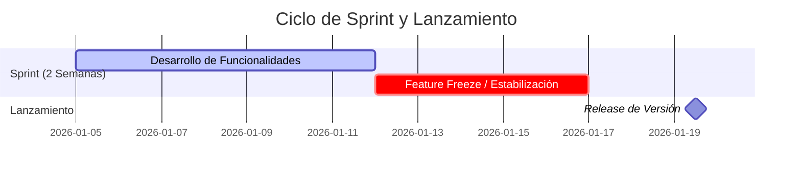

# zymDev Core Framework 🧩

**zymDev Core** es el corazón tecnológico de nuestra empresa. Se trata de un framework de desarrollo propio, diseñado para proporcionar una base robusta, escalable y eficiente sobre la cual se construyen todos los demás productos de zymDev (Quattrol 365, PEEC, zym365, etc.).

---

## 🚀 Capacidades Multiplataforma

Una de las mayores fortalezas de **zymDev Core** es su capacidad para ejecutarse de forma nativa en múltiples entornos con una única base de código:

- 🌐 **Web**: Aplicaciones progresivas y plataformas de alto rendimiento.
- 📱 **Android**: Apps móviles optimizadas para el ecosistema de Google.
- 🍏 **iOS**: Experiencias fluidas y nativas para dispositivos Apple.
- 🐧 **Linux**: Binarios eficientes para distribuciones de escritorio.
- 🍎 **MacOS**: Integración perfecta con el sistema operativo de escritorio de Apple.
- 🪟 **Windows**: Aplicaciones de escritorio potentes y estables.

---

## 🏗️ Arquitectura y Filosofía

- **Modular**: Permite activar o desactivar funcionalidades según las necesidades del producto final.
- **Segura**: Integración profunda con servicios de identidad (Google Workspace, Microsoft Entra ID).
- **Escalable**: Optimizado para trabajar con infraestructuras Serverless y Cloud Native.
- **Eficiente**: Minimiza el tiempo de desarrollo manteniendo altos estándares de calidad.

---

## 🔄 Estrategia de Lanzamiento

zymDev Core y sus productos asociados operan bajo una estrategia de **Rolling-Release**. Esto garantiza una evolución constante, donde las mejoras de seguridad, nuevas funcionalidades y optimizaciones se integran de forma continua pero controlada.

- **Rolling Release**: Todos los productos se mantienen actualizados con el 'branch' principal del Core.
- **Versiones de Parche (Patch)**: Se liberan de forma continua ante ajustes menores.
- **Hotfixes**: Ante errores críticos que afecten la operación, se liberan de forma inmediata (ASAP) sin regirse por fechas específicas ni esperar al ciclo de sprint.

---

## 📅 Ciclo de Desarrollo y Estabilización

Nuestras versiones **Mayores** y **Menores** se rigen por un ciclo de sprint bi-semanal. La entrega final ocurre el **Lunes siguiente** a la semana de cierre del sprint.

### ❄️ Regla de Estabilización (Feature Freeze)
Para garantizar la calidad de software:
- La **segunda semana del sprint** se dedica exclusivamente a **estabilización**.
- No se aceptan nuevas mejoras ni funcionalidades durante esta semana.
- Solo se aplican correcciones de errores (*Bugfixes*) derivados de las pruebas de QA.

**Ejemplo de calendario:**
- **Viernes 16 de Enero**: Finalización del sprint.
- **Lunes 12 al Viernes 16 de Enero**: Semana de Estabilización (No se aceptan cambios nuevos).
- **Lunes 19 de Enero**: Lanzamiento de la versión (ej. v4.1.0).

### 📊 Diagrama de Flujo del Sprint

---

## 📖 Glosario de Versiones

| Tipo de Versión | Formato | Descripción |
| :--- | :--- | :--- |
| **Mayor** | `X.0.0` | Cambios estructurales profundos o cambios que rompen compatibilidad. |
| **Menor** | `0.X.0` | Nuevas funcionalidades, módulos o mejoras notables en la experiencia de usuario. |
| **Parche** | `0.0.X` | Corrección de errores menores, parches de seguridad o mejoras de rendimiento. |
| **Hotfix** | `0.0.X` | Corrección crítica de errores que afectan la operación; se libera de inmediato (ASAP) sin fecha fija. |

---

## 📅 Próximos Lanzamientos (Roadmap)

Nuestra hoja de ruta proyectada para el año 2026 incluye los siguientes hitos:

| Versión | Fecha Estimada | Objetivos Principales |
| :--- | :--- | :--- |
| **v4.4.0** | 13 de Abril, 2026 | Mejoras de rendimiento y estabilidad en el Core. |
| **v5.0.0** | 11 de Mayo, 2026 | **Hito Mayor**: Sistema unificado para todos los productos, nuevos sistemas de versionamiento, pruebas y seguimiento. |
| **v5.1.0** | 8 de Junio, 2026 | Integración con sistemas contables y Google Workspace. |
| **v5.2.0** | 6 de Julio, 2026 | Módulo de gestión contable consolidado. |
| **v5.3.0** | 3 de Agosto, 2026 | Refinamiento de integraciones de terceros. |
| **v5.4.0** | 31 de Agosto, 2026 | Optimización de infrautilidad y seguridad avanzada. |
| **v6.0.0** | 28 de Septiembre, 2026 | Nueva arquitectura de microservicios y escalabilidad global. |

---

## 📜 Historial de Versiones

Consulta las notas de lanzamiento de nuestras versiones actuales:

- [Versión 4.3.4](versions/v4.3.4.md) (Actual)
- [Versión 4.3.3](versions/v4.3.3.md)
- [Versión 4.3.2](versions/v4.3.2.md)
- [Versión 4.3.1](versions/v4.3.1.md)
- [Versión 4.3.0](versions/v4.3.0.md)
- [Versión 4.2.7](versions/v4.2.7.md)
- [Versión 4.2.6](versions/v4.2.6.md)
- [Versión 4.2.5](versions/v4.2.5.md)
- [Versión 4.2.4](versions/v4.2.4.md)
- [Versión 4.2.3](versions/v4.2.3.md)
- [Versión 4.2.2](versions/v4.2.2.md)
- [Versión 4.2.1](versions/v4.2.1.md)
- [Versión 4.2.0](versions/v4.2.0.md)

---
[Volver al Inicio](../README.md)
